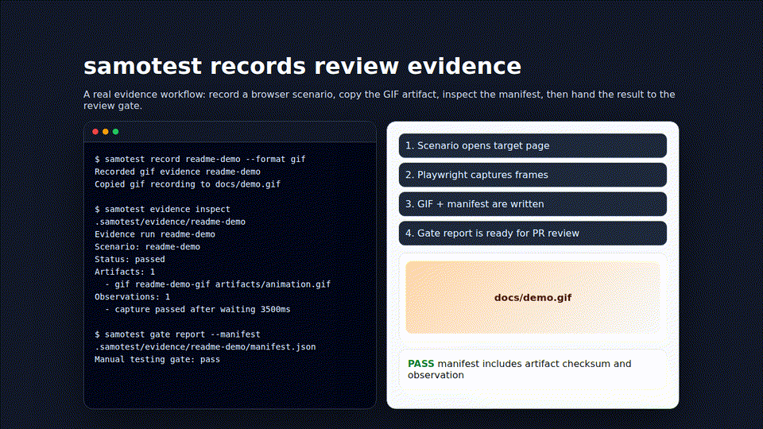

# samotest

Manual test scenario runner and evidence gate CLI for reviewer-visible dogfooding.



The packaged `samotest` bin is executed with Bun. Use Bun 1.3.13 or newer for local dogfooding, tarball installs, and PR checks.

## Release Status

`samotest` v0.2.0 is ready for early real use through a local checkout, a local tarball from `bun pm pack`, or a published package once available. Evidence upload/comment posting is available for GitHub PRs with `GITHUB_TOKEN` or authenticated `gh`, and for GitLab MRs/issues with `GITLAB_TOKEN` or `GLAB_TOKEN`; use `--dry-run` to inspect the exact upload and comment actions without posting.

## Install For Local Dogfooding

From this repository:

```sh
bun install
bun run build
bun link
samotest --help
```

To test the installable package path without publishing:

```sh
bun install
bun pm pack --dry-run
bun pm pack
bun add -g ./samotest-0.2.0.tgz
samotest --version
```

## Quickstart

Initialize a repository for local scenarios and evidence:

```sh
samotest init
```

Add or copy scenario YAML files into `.samotest/scenarios/`. The committed sample scenarios in this repo are under `.samotest/scenarios/` and can be used as schema examples.

Validate scenarios:

```sh
samotest scenario validate .samotest/scenarios/my-scenario.yaml
```

The command exits non-zero with field-level errors when the scenario is invalid.

Run a guided scenario and record step results:

```sh
samotest run my-scenario --output .samotest/evidence --run-id local-smoke
```

Attach evidence during the prompt with lines such as:

```text
screenshot path/to/screenshot.png
log path/to/output.log
```

Generate native recorder evidence when local dependencies are available:

```sh
samotest doctor
samotest record my-browser-scenario --format screenshot
samotest record my-browser-scenario --format video
samotest record my-browser-scenario --format gif
samotest record my-terminal-scenario --format cast
```

Browser screenshots and videos use Playwright Chromium. GIF capture samples browser frames for `recording.duration_ms` and converts them with `ffmpeg`; when `ffmpeg` is unavailable but browser video works, `record --format gif` writes video fallback evidence and says how to install `ffmpeg`. Terminal casts use `asciinema` and fail clearly if it is not installed. Generated screenshot, video, GIF, and cast files are written under `artifacts/` and included in `manifest.json` with sha256 checksums. Set `recording.output_path` when a docs/demo copy should be refreshed alongside the evidence artifact.

Inspect committed or generated evidence manifests:

```sh
samotest evidence inspect samples/evidence/sprint1-cli-smoke/manifest.json
samotest evidence inspect samples/evidence/sprint1-cli-smoke --format json
```

Check the evidence gate in the stable JSON format consumed by `samorev`:

```sh
samotest gate check --manifest samples/evidence/sprint1-cli-smoke/manifest.json --format json
```

The committed sample manifest uses immutable raw GitHub URLs plus sample provider-owned posting metadata so this local quickstart can pass before the package is published. For real PR/MR review evidence, required artifacts need provider-accessible URLs, a provider-hosted manifest URL, and a `samotest evidence upload` summary comment/note URL; local-only, link-only, or URL-less locally forged summaries fail the gate.

The exact `samorev` invocation, exit-code contract, and review note shape are documented in [docs/samorev-integration.md](docs/samorev-integration.md). A complete sample review note lives at [samples/samorev/review-note.md](samples/samorev/review-note.md).

Package or report evidence:

```sh
samotest evidence package samples/evidence/sprint1-cli-smoke --format zip
samotest gate report --manifest samples/evidence/sprint1-cli-smoke/manifest.json --format markdown
```

Evidence package, provider upload/comment dry-run, markdown report, and `samorev` handoff commands are available for local dogfooding. Run `samotest evidence upload` for the target GitHub PR or GitLab MR/issue so the tool posts the readable summary and records provider-owned manifest metadata before the gate is treated as passing.

## PR Checks

Pull requests run:

```sh
bun install --frozen-lockfile
bun test
bun run typecheck
bun run build
```

Run the same commands locally before opening or updating a PR.
